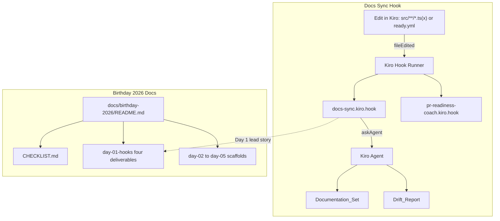

# Design Document

## Overview

Two deliverables, no product CLI/Lambda/CDK code changes:

1. **Docs Sync Check** — `.kiro/hooks/docs-sync.kiro.hook` (`askAgent` on `fileEdited` for `src/**/*.ts(x)` and `ready.yml`) producing a short Drift_Report against the Documentation_Set.
2. **Birthday 2026 materials** — `docs/birthday-2026/` with Day 1 paste-ready form / Builder Center / social / silent video script, plus Days 2–5 scaffolds.

Hook work already matches Requirements 1–3. Birthday materials satisfy Requirements 4–9.

### Design Decisions (hook)

1. **`askAgent` over `runCommand`** — Semantic code↔docs comparison; each fire **uses Kiro credits**. Existing product hooks stay on `runCommand`.
2. **IDE events only** — Outside-Kiro edits do not fire hooks. Smoke and demo must use Kiro save/edit.
3. **Own hook file** — Do not mutate the four existing hooks. Overlap with PR Readiness Coach on `src/` TS saves is expected.
4. **No `timeout` on `askAgent`** — Timeouts are for `runCommand` in this repo’s IDE schema.
5. **Report only** — Prompt forbids unsolicited file edits.
6. **Scoped globs** — Repo-root `src/` + `ready.yml` only (`web/` excluded).

### Design Decisions (Birthday docs)

1. **Separate tree** — `docs/birthday-2026/` parallel to `docs/builder-center/`; do not replace the full product ARTICLE.
2. **Same four filenames every day** — `form-submission.md`, `builder-center-post.md`, `social-post.md`, `video-slideshow.md` so later days are fill-in.
3. **Day 1 leads with Docs Sync** — Form/social/video headline the new hook; inventory other hooks in one-liners.
4. **Silent video = smoke runbook** — `video-slideshow.md` is the single source for Task 4 (manual Kiro smoke) and the captions-only demo script. Same beats, expected results, still vs live; no separate smoke doc.
5. **Kiro_Only_Voice** — All Day 1 user-facing copy credits Kiro only.
6. **No PII in repo** — Form contact fields stay off-repo.

## Architecture



### Hook Coexistence Matrix

| Hook | Trigger | Action | Conflict with docs-sync? |
|------|---------|--------|--------------------------|
| PR Readiness Coach | `fileEdited` `*.ts, *.tsx, *.js, *.mjs` | `runCommand` | No — may both fire on `src/` TS |
| PR Readiness Coach (Full) | `userTriggered` | `runCommand` | No |
| Build Check | `agentStop` | `runCommand` | No |
| Test After Task | `postTaskExecution` | `runCommand` | No |
| **Docs Sync Check** | `fileEdited` `src/**/*.ts, src/**/*.tsx, ready.yml` | `askAgent` | N/A |

## Components and Interfaces

### Hook File: `.kiro/hooks/docs-sync.kiro.hook`

| Field | Value |
|-------|--------|
| `enabled` | `true` |
| `name` | `"Docs Sync Check"` |
| `description` | Short purpose string |
| `version` | `"1"` |
| `when.type` | `"fileEdited"` |
| `when.patterns` | `["src/**/*.ts", "src/**/*.tsx", "ready.yml"]` |
| `then.type` | `"askAgent"` |
| `then.prompt` | See Prompt Design |

### Prompt Design

```text
A matching file was just edited. Compare that change against this Documentation_Set only:
- README.md
- docs/OPERATOR_WALKTHROUGH.md
- docs/capture/

Produce a short Drift_Report: list each affected documentation path and the concrete edits required.
If nothing needs updating, reply exactly that no documentation updates are needed.

Rules:
- Report drift only. Do not suggest unrelated refactors, style changes, or extra improvements.
- Do not edit files unless asked in a follow-up; this hook is detection and report only.
- If the edited file is ready.yml, specifically check OPERATOR_WALKTHROUGH sections that describe ready.yml / Definition of Ready.
- Do not name other IDEs or AI assistants. Speak in terms of this repository and Kiro hooks.
```

### Birthday docs layout

```text
docs/birthday-2026/
  README.md
  CHECKLIST.md
  day-01-hooks/
    README.md
    form-submission.md
    builder-center-post.md
    social-post.md
    video-slideshow.md
  day-02/ … day-05/
    README.md
    form-submission.md
    builder-center-post.md
    social-post.md
    video-slideshow.md
```

### Day 1 deliverable content (interfaces)

| File | Contents |
|------|----------|
| `form-submission.md` | Day 1, project name, repo URL, 2–3 sentence description, 150–300 word “how Kiro was used”, placeholders for video URL + social URL |
| `builder-center-post.md` | Problem → Docs Sync solution → spec-driven build → repo link; clear headings |
| `social-post.md` | 2–3 sentences, repo link, `#BuildWithKiro` `#TeamKiro` `@kirodotdev`, attach-video note |
| `video-slideshow.md` | **Smoke runbook + silent demo script** (Req 8): timed captions, still/live, positive `src/` + `ready.yml`, short negative note, close |

### Video / smoke beat sheet (single source)

Documented in `video-slideshow.md` and executed manually in Kiro (credits):

| # | Beat | Capture | Expected |
|---|------|---------|----------|
| 1 | Title — Day 1 / Docs Sync Check / repo | Still | — |
| 2 | Agent Hooks panel — Docs Sync enabled | Still | Hook listed |
| 3 | Edit/save `src/**/*.ts` in Kiro | Live | Docs Sync fires; Drift_Report or no-updates |
| 4 | Edit/save `ready.yml` in Kiro | Live | Docs Sync fires; coach does not |
| 5 | Caption: `web/` / docs edits do not fire Docs Sync; coach may fire with Docs Sync on `src/` TS | Still or caption-only | Negatives documented |
| 6 | Close — repo URL + hashtags | Still | — |

This set satisfies smoke verification **and** the Day 1 video script. Encoding the MP4 remains out of scope.
## Data Models

Hook JSON (same IDE schema family as existing hooks):

```json
{
  "enabled": true,
  "name": "Docs Sync Check",
  "description": "Ask whether README / operator walkthrough / capture docs need updates after src or ready.yml edits",
  "version": "1",
  "when": {
    "type": "fileEdited",
    "patterns": ["src/**/*.ts", "src/**/*.tsx", "ready.yml"]
  },
  "then": {
    "type": "askAgent",
    "prompt": "<Prompt Design text>"
  }
}
```

Birthday materials are Markdown documents only — no runtime schema.

## Error Handling

| Scenario | Behavior |
|----------|----------|
| Agent cannot read a doc path | Call out unread path; finish useful report |
| Invalid hook JSON | Runner ignores file |
| Edit outside Kiro | Hook does not fire |
| Credits exhausted | Failure in Kiro UI only |
| Missing video/social URLs in form draft | Placeholders left until media/post exist |
| Day 2–5 prompts not yet public | Placeholder README text only |

## Correctness Properties

### Property 1: Valid Hook Schema

Hook file parses as JSON with required fields and values per Requirements 1.1–1.2.

**Validates: Requirements 1.1, 1.2**

### Property 2: Correct Trigger Configuration

`when.type` = `"fileEdited"`; patterns exactly `["src/**/*.ts","src/**/*.tsx","ready.yml"]`.

**Validates: Requirements 1.3**

### Property 3: Correct Action and Prompt Scope

`then.type` = `"askAgent"`; prompt covers Documentation_Set, report-only, ready.yml special case, no other tools named.

**Validates: Requirements 1.4, 1.5, 2.1, 2.2, 2.3, 2.4, 2.5, 2.6, 3.1, 3.2, 3.3**

### Property 4: No Existing Hook Mutation

*For any* checkout of this feature branch, the four pre-existing `.kiro/hooks/*.kiro.hook` files SHALL have identical content to their state before this feature — no fields added, removed, or modified.

**Validates: Requirements 1.6**

### Property 5: Birthday Tree Completeness

*For any* valid checkout of this feature branch, `docs/birthday-2026/` SHALL contain:

- `README.md` (event overview with links)
- `CHECKLIST.md` (day-by-day tracker)
- `day-01-hooks/` with all 5 files: `README.md`, `form-submission.md`, `builder-center-post.md`, `social-post.md`, `video-slideshow.md`
- `day-02/` through `day-05/` each with `README.md` + the same four template deliverables (`form-submission.md`, `builder-center-post.md`, `social-post.md`, `video-slideshow.md`)

**Validates: Requirements 4.1, 4.2, 4.3, 4.4, 5.1, 6.1, 7.1, 8.1**

### Property 6: Kiro_Only_Voice Compliance

*For any* file under `docs/birthday-2026/day-01-hooks/`, the content SHALL NOT name other IDEs or AI assistants, and SHALL contain at least one attribution to Kiro (specs, hooks, steering, or agent workflow).

**Validates: Requirements 9.1, 9.2**

## Testing Strategy

### Hook

1. JSON parse + Properties 1–3
2. Manual Kiro smoke (credits): `src/` edit, `ready.yml` edit, negatives (`web/`, docs), coexistence

### Birthday docs

1. Path presence (Property 5–6)
2. Day 1 form/social/Builder Center lengths and Kiro_Only_Voice
3. `video-slideshow.md` includes full smoke runbook table (positives, negatives, credits/IDE note) **and** caption timings — satisfies Task 4 documentation and Req 8

### Out of Scope (design)

- Recording or encoding the actual demo video file (MP4/WebM)
- Publishing the social post or submitting the web form
- Capturing new screenshot/PNG assets (script marks needed beats only)
- Rewriting `docs/builder-center/ARTICLE.md` (full product article stays untouched)
- Filling Day 2–5 content beyond placeholder READMEs and template filenames (prompts TBA daily)
- Modifying the four pre-existing hooks
- Automated tests of agent Drift_Report quality (prompt output is non-deterministic)
- Changing CLI, Lambda, web, or CDK product behavior
- Contact/eligibility form fields (name, email, address) — never stored in repo

---

## Birthday 2026 Documentation Architecture

Detailed file tree for `docs/birthday-2026/` (Requirements 4–9):

```text
docs/birthday-2026/
├── README.md                        # Event overview, links to birthday page / terms / form, Day 1–5 pointers
├── CHECKLIST.md                     # Day-by-day tracker: commit / video / social / form per day
├── day-01-hooks/
│   ├── README.md                    # Day 1 prompt + what we built (Docs Sync Check)
│   ├── form-submission.md           # Paste-ready challenge form fields
│   ├── builder-center-post.md       # Problem → solution → Kiro-driven dev → repo link
│   ├── social-post.md               # 2–3 sentences + tags + attach-video note
│   └── video-slideshow.md           # Smoke runbook + silent demo beat table
├── day-02/
│   ├── README.md                    # Placeholder (prompt TBA)
│   ├── form-submission.md           # Template
│   ├── builder-center-post.md       # Template
│   ├── social-post.md               # Template
│   └── video-slideshow.md           # Template
├── day-03/
│   ├── README.md
│   ├── form-submission.md
│   ├── builder-center-post.md
│   ├── social-post.md
│   └── video-slideshow.md
├── day-04/
│   ├── README.md
│   ├── form-submission.md
│   ├── builder-center-post.md
│   ├── social-post.md
│   └── video-slideshow.md
└── day-05/
    ├── README.md
    ├── form-submission.md
    ├── builder-center-post.md
    ├── social-post.md
    └── video-slideshow.md
```

### Naming Conventions

- Day directories: `day-01-hooks`, `day-02`, `day-03`, `day-04`, `day-05` (Day 1 gets a suffix because its theme is known)
- Four deliverable filenames are identical across all days — fill-in pattern
- Root files (`README.md`, `CHECKLIST.md`) are the only non-day-folder items

---

## Day 1 Content Design

### `form-submission.md` Structure

| Field | Content |
|-------|---------|
| Challenge Day | Day 1 |
| Project Name | PR Readiness Coach |
| Repository URL | `https://github.com/jajera/pr-readiness-coach` |
| Short Description | 2–3 sentences: what the project does, the new hook added for Day 1 |
| How Kiro Was Used | 150–300 words (see guidance below) |
| Demo Video URL | `<!-- placeholder: paste URL after recording -->` |
| Social Post URL | `<!-- placeholder: paste URL after posting -->` |

**"How Kiro Was Used" guidance** (150–300 words):

1. **Lead with Docs Sync Check**: spec workflow (requirements → design → tasks) drove hook creation → smoke verification inside Kiro
2. **Brief inventory of all 5 hooks** (PR Readiness Coach, PR Readiness Coach Full, Build Check, Test After Task, Docs Sync Check) — one line each with trigger/action
3. **Mention steering files** that guided project conventions and agent behaviour
4. **Spec-driven development emphasis**: requirements.md → design.md → tasks.md workflow as the backbone
5. Kiro_Only_Voice throughout — no other IDEs or AI assistants named

### `builder-center-post.md` Structure

```markdown
# Day 1: Docs Sync Check — Keeping Docs in Sync with Code

## Problem
<!-- 1–2 paragraphs: documentation drifts from source; manual checks are forgotten;
     developers ship code without updating README / walkthrough / capture notes -->

## Solution
<!-- 2–3 paragraphs: Docs Sync Check hook fires on src/ and ready.yml edits;
     produces Drift_Report naming exact doc paths + edits needed;
     detection only — no unsolicited file edits -->

## How Kiro Drove It
<!-- 1–2 paragraphs: spec workflow (requirements.md → design.md → tasks.md);
     property-based verification of hook schema; steering files guided conventions;
     agent workflow from spec through implementation -->

## Hook Inventory
<!-- One-liner each for the 5 hooks in this repo: -->
- **Docs Sync Check** — `fileEdited` on `src/**/*.ts(x)` + `ready.yml` → `askAgent` Drift_Report
- **PR Readiness Coach** — `fileEdited` on `*.ts, *.tsx, *.js, *.mjs` → `runCommand` readiness check
- **PR Readiness Coach (Full)** — `userTriggered` → `runCommand` full AI pipeline
- **Build Check** — `agentStop` → `runCommand` compile verification
- **Test After Task** — `postTaskExecution` → `runCommand` test suite

## Repo Link
Repository: https://github.com/jajera/pr-readiness-coach
```

This is a **standalone article** — NOT a rewrite of the existing `docs/builder-center/ARTICLE.md`.
Headings are suitable for Builder Center formatting. Kiro_Only_Voice applies.

### `social-post.md` Structure

```markdown
Day 1 of the Kiro Birthday 2026 challenge: built a Docs Sync Check hook
that catches documentation drift the moment I save source files.
Specs → hooks → agent workflow — all inside Kiro.

https://github.com/jajera/pr-readiness-coach

#BuildWithKiro #TeamKiro @kirodotdev

📎 Attach demo video when posting.
```

Rules: 2–3 sentences max before link. Tags/mention mandatory. Attach-video note at end. Kiro_Only_Voice.

### `day-01-hooks/README.md` Structure

- Day 1 theme: Kiro Agent Hooks
- What was built: Docs Sync Check hook
- Links to the four deliverable files in this folder
- Brief note on smoke verification (pointer to `video-slideshow.md`)

---

## Video Slideshow / Smoke Runbook Design

`docs/birthday-2026/day-01-hooks/video-slideshow.md` serves **two purposes**:

1. **Smoke runbook** — procedural steps to verify Docs Sync Check works in Kiro (Task 4)
2. **Silent demo script** — caption-only video for Day 1 submission (30–60s target, max 3 min)

### Prerequisites

- Kiro IDE open with the `pr-readiness-coach` workspace loaded
- Docs Sync Check hook enabled (visible in Agent Hooks panel)
- Kiro credits available (`askAgent` fires consume credits)
- All actions are IDE-only — outside-Kiro edits do not trigger hooks

### Beat Table Template

The following table is the canonical beat sheet for `video-slideshow.md`:

| # | Beat | Caption | On-Screen | Still/Live | Expected Result |
|---|------|---------|-----------|------------|-----------------|
| 1 | Title card | "Day 1 — Docs Sync Check" | Project name + Day 1 theme + repo URL | Still | — |
| 2 | Hooks panel | "Five hooks configured, Docs Sync Check enabled" | Agent Hooks panel showing all hooks, Docs Sync Check highlighted | Still | Hook listed and enabled |
| 3 | Positive: `src/*.ts` save | "Saving a TypeScript file under src/ …" | Editor with a trivial edit to any `src/**/*.ts` file, then save | Live | Docs Sync Check fires; agent produces Drift_Report or states no updates needed |
| 4 | Positive: `ready.yml` save | "Saving ready.yml …" | Editor with a trivial edit to `ready.yml`, then save | Live | Docs Sync Check fires; PR Readiness Coach does **not** fire |
| 5 | Negative note | "Files outside src/ and ready.yml don't trigger Docs Sync; src/ TS may co-fire PR Readiness Coach" | Caption overlay (no live action required) | Still / caption-only | Negatives documented for viewer |
| 6 | Close card | "Built with Kiro — specs, hooks, agent workflow" | Repo URL + `#BuildWithKiro` `#TeamKiro` `@kirodotdev` | Still | — |

### Per-Beat Notes

- **Beat 3**: Any trivial whitespace or comment edit suffices. The key verification is that the Docs Sync hook fires and produces output.
- **Beat 4**: Edit a field value in `ready.yml` (e.g., toggle a threshold). Verify PR Readiness Coach (`*.ts` glob) does NOT fire on a `.yml` save.
- **Beat 5**: No live capture needed. This beat is informational — documents negative cases for the smoke and gives viewer context on scope.
- **Credits**: Each live beat (3, 4) consumes one `askAgent` credit invocation. Keep edits trivial. Disable Docs Sync Check after demo to conserve credits.

### Recording Notes (out of scope for implementation)

- Capture beats in order; each beat is one screen segment
- Target 5–10s per beat (6 beats × ~8s = ~48s total)
- Captions only, no voiceover — accessible and language-neutral
- Encoding/upload is not part of these tasks; the written runbook satisfies documentation

---

## Kiro_Only_Voice Design

Rules for all user-facing text in `docs/birthday-2026/day-01-hooks/` deliverables:

### Voice Rules

1. **Lead with "Built with Kiro" framing** — every deliverable opens by crediting Kiro as the development environment
2. **Reference Kiro concepts by name** — specs (requirements, design, tasks), hooks, steering files, agent workflow, Kiro IDE
3. **Never name other IDEs** — no mentions of VS Code, IntelliJ, Cursor, Windsurf, or any other editor
4. **Never name other AI assistants** — no mentions of Copilot, ChatGPT, Claude (as a product), or other AI coding tools
5. **Do not imply a multi-tool workflow** — the narrative is single-environment (Kiro) from spec to ship
6. **Repository URL is always** `https://github.com/jajera/pr-readiness-coach`

### Application by File

| File | Voice Application |
|------|-------------------|
| `form-submission.md` | "How Kiro was used" section leads with spec→hook→smoke inside Kiro |
| `builder-center-post.md` | "Kiro-Driven Development" heading; specs/hooks/steering referenced |
| `social-post.md` | "Built with Kiro" + `@kirodotdev` mention |
| `video-slideshow.md` | Captions reference "Kiro Agent Hooks panel", "Kiro specs", no other tools |
| `day-01-hooks/README.md` | Describes what was built using Kiro terminology only |

### Validation Approach

Property 6 (Kiro_Only_Voice Compliance) is verified by scanning all files under `docs/birthday-2026/` for:
- Absence of competitor IDE names (case-insensitive regex)
- Absence of competitor AI assistant names
- Presence of at least one Kiro attribution term per deliverable file
