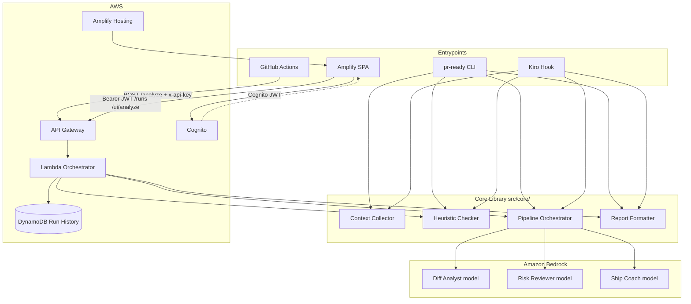
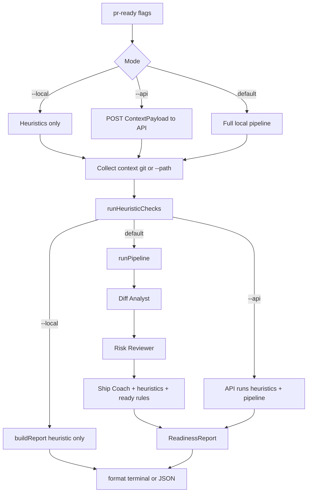

# Design Document

## Overview

PR Readiness Coach is a TypeScript monorepo that evaluates Git branch readiness through a multi-agent AI pipeline. Three entrypoints share one core library:

1. **CLI** (`pr-ready`) — local developer tool
2. **AWS Lambda** — API Gateway-backed orchestrator for remote invocations (GitHub Actions)
3. **Kiro Hook** — warn-only analysis on configured `pre-push` / `userTriggered` events

Architecture is pipes-and-filters: context collection → heuristic pre-screening → sequential multi-agent pipeline (Diff Analyst → Risk Reviewer → Ship Coach) → structured report.

**Key design decisions**

- **Monorepo + shared core** (`src/core/`) — CLI, Lambda, and Hook call the same module
- **Bedrock Converse API** — unified messaging for Nova and Claude (or Nova-only fallback)
- **AWS CDK (TypeScript)** — IaC for API Gateway, Lambda, IAM, API key/usage plan, DynamoDB, Cognito, Amplify app/branch (not SAM; keeps app + infra in one language)
- **Commander.js** — CLI flags
- **Sequential pipeline, no retries** — weekend scope; agent failure → heuristic-only report
- **Warn-only gates** — Hook and GitHub Actions never block merge in v1
- **API auth** — Dual path: API keys for GHA/CLI (`POST /analyze`); Cognito JWT for owner UI routes. No WAF / IAM SigV4 for machine clients
- **Full-mode AI always runs** — heuristic blockers do not skip the AI pipeline; Ship Coach merges heuristic + AI findings
- **Lambda re-checks heuristics** — do not trust client-only heuristic results for security-sensitive blockers
- **Owner UI** — Amplify Hosting zip deploy (`web/`); no GitHub↔Amplify Git connection

## Architecture



### Data flow



**Notes**

- Heuristic findings are always included in the report.
- In full mode, AI still runs even when heuristics find blockers; Ship Coach merges findings; Verdict uses combined blockers/warnings.
- Only `--local` or Bedrock failure skips AI (`pipelineMode: heuristic-only`).

## Components and Interfaces

### Module structure

```text
src/
├── core/
│   ├── context/
│   │   ├── collector.ts       # git + fixture/path collection
│   │   ├── ready-config.ts    # ready.yml parse + defaults (no pretty-printer in v1)
│   │   └── types.ts
│   ├── heuristics/
│   │   ├── checker.ts
│   │   ├── patterns.ts
│   │   └── types.ts
│   ├── pipeline/
│   │   ├── orchestrator.ts
│   │   ├── diff-analyst.ts
│   │   ├── risk-reviewer.ts
│   │   ├── ship-coach.ts
│   │   └── types.ts
│   ├── report/
│   │   ├── builder.ts         # verdict, checklist, merge findings
│   │   ├── formatter.ts       # human + JSON
│   │   └── types.ts
│   ├── bedrock/
│   │   ├── client.ts          # Converse API wrapper
│   │   └── types.ts
│   └── errors.ts
├── cli/
│   ├── index.ts
│   ├── commands.ts
│   └── output.ts
├── lambda/
│   ├── handler.ts
│   └── response.ts
├── hook/
│   └── kiro-hook.ts
infra/                         # AWS CDK app (TypeScript)
├── bin/app.ts
├── lib/pr-readiness-stack.ts
fixtures/
├── demo-app/
│   ├── not-ready/
│   └── ready/
└── demo.sh
.github/workflows/
├── ci.yml                     # replace stub; npm test/build (+ optional cdk synth)
├── deploy.yml
└── pr-ready.yml
docs/
├── builder-center/
├── capture/
└── OPERATOR_WALKTHROUGH.md
```

### Key interfaces

```typescript
interface ContextPayload {
  repoPath: string;
  branch: string;
  mergeBase: string;
  diff: string;
  diffTruncated: boolean;
  diffOriginalSize?: number;
  changedFiles: string[];
  gitStatus: string;
  testSignals?: TestSignals;
  specTaskCounts?: { open: number; total: number };
  definitionOfReady: DefinitionOfReady;
  source: 'git' | 'fixture-path';
}

interface TestSignals {
  passCount?: number;
  failCount?: number;
  lineCoverage?: number;
}

interface DefinitionOfReady {
  testFilePatterns?: string[];
  forbiddenPatterns?: string[];
  maxDiffSizeBytes?: number; // 1024..10485760
  customBlockers?: CustomBlocker[]; // max 20
  // requiredReviewers intentionally omitted from v1 enforcement
}

interface CustomBlocker {
  pattern: string;
  severity: 'blocker' | 'warning';
  description?: string;
}

interface HeuristicResult {
  blockers: Finding[];
  warnings: Finding[];
  durationMs: number;
}

interface Finding {
  severity: 'blocker' | 'warning';
  category: string;
  filePath?: string;      // optional when unknown
  lineNumber?: number;    // optional when unknown
  description: string;
}

interface DiffAnalysis {
  summary: string;
  changesBreakdown: ChangeCategory[];
  patterns: string[];
  concerns: string[];
}

interface ChangeCategory {
  category: string;
  files: string[];
  description: string;
}

interface RiskAssessment {
  securityRisks: RiskItem[];
  complexityRisks: RiskItem[];
  coverageGaps: RiskItem[];
  overallRiskLevel: 'low' | 'medium' | 'high';
}

interface RiskItem {
  description: string;
  filePath?: string;
  lineNumber?: number;
  severity: 'blocker' | 'warning';
}

type Verdict = 'READY' | 'READY WITH WARNINGS' | 'NOT READY';

interface ReadinessReport {
  verdict: Verdict;
  blockers: Finding[];
  warnings: Finding[];
  checklist: ChecklistItem[];
  draftPrTitle?: string;
  draftPrBody?: string;
  topActions?: string[];
  metadata: ReportMetadata;
}

interface ChecklistItem {
  rule: string;
  passed: boolean;
  detail?: string;
}

interface ReportMetadata {
  branch: string;
  timestamp: string; // ISO 8601
  pipelineMode: 'full' | 'heuristic-only';
  aiUnavailableWarning?: string;
  modelIds?: {
    diffAnalyst: string;
    riskReviewer: string;
    shipCoach: string;
  };
}

interface BedrockAgentConfig {
  modelId: string;
  systemPrompt: string;
  maxTokens: number;
  temperature: number;
  timeoutMs: number; // per-call, default 20000
}

interface BedrockClient {
  converse(config: BedrockAgentConfig, userContent: string): Promise<string>;
}

type PipelineResult =
  | { ok: true; report: ReadinessReport }
  | { ok: false; report: ReadinessReport; reason: string }; // degraded still has report
```

### Agent prompt strategy

| Agent | Default model family | Temp | Max tokens | Input | Output JSON |
|-------|----------------------|------|------------|-------|-------------|
| Diff Analyst | Nova (e.g. nova-lite) | 0.2 | 2048 | ContextPayload | DiffAnalysis |
| Risk Reviewer | Nova | 0.3 | 2048 | Context + DiffAnalysis | RiskAssessment |
| Ship Coach | Claude Haiku 4.5 via AU inference profile (if enabled), else Nova | 0.4 | 4096 | Diff + Risk + heuristics + DefinitionOfReady | Ship fields for report |

Model IDs via env (examples):

- `DIFF_ANALYST_MODEL_ID` (fallback `NOVA_MODEL_ID`)
- `RISK_REVIEWER_MODEL_ID` (fallback `NOVA_MODEL_ID`)
- `SHIP_COACH_MODEL_ID` (fallback `CLAUDE_MODEL_ID` or `NOVA_MODEL_ID`)

Recommended starting IDs (adjust to account/region availability):

- `NOVA_MODEL_ID=amazon.nova-lite-v1:0`
- `CLAUDE_MODEL_ID=au.anthropic.claude-haiku-4-5-20251001-v1:0`

Ship Coach must receive heuristic blockers/warnings so Verdict and top actions stay consistent with local findings.

### Bedrock integration

Use `@aws-sdk/client-bedrock-runtime` Converse API. Local CLI full mode and Lambda both call the same `BedrockClient` wrapper. Parse model JSON strictly; on parse failure treat as agent failure → degrade.

### CLI design

```text
pr-ready [options]

Options:
  --json              JSON report on stdout (progress on stderr)
  --local             Heuristic only (no Bedrock)
  --path <dir>        Fixture/directory mode (no git); intended with --local for demos
  --api               POST context to deployed API
  --api-url <url>     Override API URL
  --api-key <key>     API key (or env PR_READY_API_KEY)
  -h, --help
  -V, --version

Exit codes:
  0  READY or READY WITH WARNINGS
  1  NOT READY
  2  Usage / no git (when required) / API transport errors
```

Default (no `--local` / `--api`): git context + heuristics + Bedrock via caller AWS credentials.

### Lambda handler design

```text
POST /analyze
Headers: x-api-key: <key>
Body: ContextPayload JSON (max 1 MB)

Response 200: ReadinessReport JSON (including degraded heuristic-only reports)
Response 400: invalid JSON / oversize
Response 403: bad/missing API key
Response 502: only if even heuristic report cannot be produced

Timeout: ≥ 90s (document actual in capture notes)
Memory: 512 MB (raise if needed)
```

Lambda runs Heuristic_Check on the provided payload (re-check patterns on `diff` / `changedFiles`) then pipeline, same as CLI core path.

### Infrastructure (CDK)

`infra/` CDK stack creates:

- API Gateway REST API + API key + usage plan
- Lambda (Node.js 24.x) bundling `src/lambda` + `src/core`
- IAM role: logs + `bedrock:InvokeModel` (and Converse equivalents as required)
- DynamoDB table behind `-c enableDynamo=true` (Deploy enables it; GSI `byRepo`, TTL ~30d)
- Cognito user pool (owner-only) + Amplify app/branch (SPA zip-deployed after CDK)
- Stack outputs: `ApiUrl`, `ApiKeyId`, Cognito IDs, `AmplifyAppId`, `AmplifyBranchName`, `AppUrl`

Deploy: `.github/workflows/deploy.yml` on `main` via OIDC → `cdk deploy` (`enableDynamo=true`) → separate `deploy-amplify` zip job.

## Data models

### ready.yml schema (v1)

```yaml
testFilePatterns:
  - "tests/**"
  - "**/*.test.ts"
forbiddenPatterns:
  - "*.env"
  - "*.env.*"
  - "*.pem"
maxDiffSizeBytes: 102400
customBlockers:
  - pattern: "HACK"
    severity: blocker
    description: "HACK comments indicate unfinished work"
  - pattern: "no-commit"
    severity: warning
```

Defaults when missing/invalid: built-in secret/path blockers, TODO/FIXME warnings, debug-log warnings, large-diff warning at 100 KB.

### DynamoDB run history (optional)

| Attribute | Type | Description |
|-----------|------|-------------|
| runId | S (PK) | UUID |
| timestamp | S | ISO 8601 |
| branch | S | Branch or fixture label |
| verdict | S | Verdict |
| blockerCount | N | Blocker count |
| warningCount | N | Warning count |
| pipelineMode | S | full / heuristic-only |
| report | S | Full JSON |
| ttl | N | ~30 days |

### Readiness report JSON

Same shape as `ReadinessReport` above; `filePath` / `lineNumber` may be omitted when unknown. `metadata.pipelineMode` is `full` or `heuristic-only`.

## Correctness properties

Keep properties that are cheap and high-value for v1. Defer pretty-printer round-trip.

**Property 1: Invalid config falls back**
For any invalid `ready.yml` (broken YAML or out-of-range values), the system SHALL apply defaults and surface a config warning in the report (or equivalent warning finding), and SHALL NOT crash the run solely due to bad config.
Validates: Requirements 1.4, 9.4

**Property 2: Diff truncation bound**
For any diff larger than 100 KB, truncated output SHALL be ≤ 100 KB and SHOULD end on a file boundary when the diff uses standard `diff --git` / unified file headers; always a prefix of the original byte content when boundary alignment is impossible.
Validates: Requirements 1.6

**Property 3: Secret pattern detection**
For any diff containing the built-in secret/sensitive markers defined in requirements, Heuristic_Check SHALL emit a blocker for each detectable match with path/line when parseable from the diff.
Validates: Requirements 2.1

**Property 4: Flaggable patterns only in added lines**
TODO/FIXME/debug patterns SHALL be flagged only on added lines (`+`), never on removed (`-`) or context lines.
Validates: Requirements 2.2, 2.3

**Property 5: Custom regex severity**
Custom rules SHALL emit findings at the configured severity for matches in added lines / scanned content.
Validates: Requirements 2.6

**Property 6: Verdict determination**
Non-empty blockers → `NOT READY`; else non-empty warnings → `READY WITH WARNINGS`; else `READY`.
Validates: Requirements 4.3–4.5, 13.3

**Property 7: Checklist coverage**
Checklist SHALL include one pass/fail item per evaluable default/custom rule applied for the run.
Validates: Requirements 4.7

**Property 8: JSON output validity**
`--json` stdout SHALL be parseable JSON representing the report (no non-JSON stdout).
Validates: Requirements 5.3

**Property 9: Exit code mapping**
`READY` and `READY WITH WARNINGS` → 0; `NOT READY` → 1.
Validates: Requirements 5.5

**Property 10: Graceful degradation shape**
On AI unavailable: warning present; omit draft PR fields and `topActions`; retain verdict/blockers/warnings/checklist.
Validates: Requirements 13

### Deferred properties (out of scope for this Spec)

- DefinitionOfReady pretty-print round-trip
- Top-actions occurrence-count ordering guarantees beyond “blockers before warnings”
- HTTP 504 partial agent result arrays

## Error handling

| Source | Recovery | User-facing |
|--------|----------|-------------|
| Git failure (git mode) | Abort | `Git operation failed: {cmd}` |
| ready.yml invalid | Defaults + warning | Failed to parse ready.yml… using defaults |
| Diff > 100 KB | Truncate + warning | Diff truncated… |
| Bedrock per-call timeout/error | Abort remaining agents; heuristic-only report | AI analysis unavailable… |
| Lambda timeout | Platform timeout; Actions treats as unavailable | Analysis temporarily unavailable |
| Invalid API body | HTTP 400 | Invalid failure |
| Bad API key | HTTP 403 | Forbidden |
| No git (non-path mode) | Exit 2 | No Git repository found |
| `--api` transport error | Exit 2 | Unable to reach API… |
| Hook timeout/error | Allow push | Analysis skipped; push proceeding |

### Timeout configuration

| Component | Timeout |
|-----------|---------|
| Heuristic checks | 5s hard target |
| Individual Bedrock call | 20s default (configurable) |
| Lambda total | ≥ 90s |
| Kiro Hook total | 30s |
| GitHub Actions API wait | 90s |

## Testing strategy

### Unit (example-based)

- Context collector: git mocked; fixture `--path` trees
- Heuristics: secret/TODO/debug samples; added-line only
- Orchestrator: mock Bedrock order + failure → degrade
- Report builder: verdict merge of heuristic + AI findings
- CLI: flags, exit codes, `--json` stdout purity
- Lambda: 400/403/200 degraded mapping
- ready.yml: valid/invalid/empty → defaults

### Property-based (fast-check)

Implement Properties 1–10 above.
Tag: `Feature: pr-readiness-coach, Property {N}: {title}`
Minimum 100 iterations where cheap; reduce for huge diff generators if needed.

### Integration

- `fixtures/demo.sh` / CLI `--local --path` against not-ready and ready
- Lambda handler with mocked Bedrock
- Optional `cdk synth` in CI on PR; deploy only on `main`

### Runner

- Vitest + fast-check
- `npm test` — unit + property
- `npm run test:integration` — separate

## GitHub Actions design

**`ci.yml`** (PR/push): replace the current stub workflow; `npm ci`, `npm test`, `npm run build`, optional `cdk synth`.

**`deploy.yml`** (push `main`): OIDC → `cdk deploy` → ensure API key exists in GitHub secret `PR_READY_API_KEY` (manual one-time secret set acceptable for weekend).

**`pr-ready.yml`** (PR opened/sync/reopened): build ContextPayload for PR base/head → POST `/analyze` → upsert PR comment → upload JSON artifact → always exit 0 (warn-only).

## Kiro design

- Specs drive this product
- Project hooks: `.kiro/hooks/pr-readiness-coach.json` (`prePush`) and `.kiro/hooks/pr-readiness-coach-manual.json` (`userTriggered`)
- Both run `npm run -s hook` → `src/hook/kiro-hook.ts` (warn-only, 30s ceiling, fail-open)
- Default Hook path is heuristic-only (`PR_READY_HOOK_LOCAL` unset or not `0`); set `PR_READY_HOOK_LOCAL=0` for full Bedrock when credentials allow
- Multi-agent prompts live in `src/core/pipeline/*` (same as Lambda)
- Capture notes: `docs/capture/01-infra-cicd.md`, `02-pr-demo-in-ci.md`, `03-kiro-loop.md`

## Out of scope (design)

Initial weekend defer list included Amplify, Cognito, and DynamoDB-on-by-default; those are now implemented (Amplify zip deploy, Cognito UI authorizer, Deploy `-c enableDynamo=true`). Still out of scope: WAF, IAM SigV4 for machine clients, hard merge gate, multi-env, AgentCore sample, pretty-printer round-trip, three published walkthrough Specs, GitHub-connected Amplify builds.
