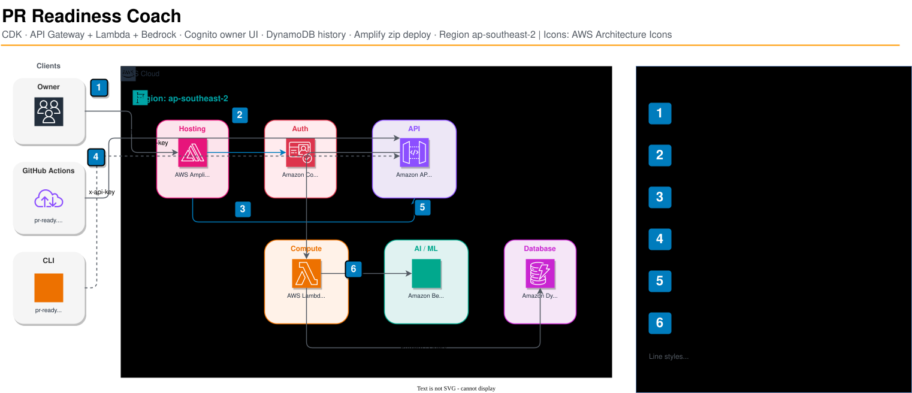

# pr-readiness-coach

AI coach that checks branch readiness before you open a pull request.

Uses Amazon Bedrock (Nova Lite + Claude Haiku) for diff analysis, risk review, and ship coaching — with heuristic-only mode available for offline use.



## Features

- **Heuristic checks** — large diffs, missing tests, secrets detection, forbidden paths
- **AI-powered analysis** — diff summary, risk review, and ship-readiness coaching via Bedrock
- **Draft PR generation** — auto-compose PR title + body from the coach output (`--apply-draft`)
- **Multiple entrypoints** — CLI, Lambda API, Kiro hook, Amplify SPA
- **Configurable rules** — project-level `ready.yml` for test globs, blockers, allowlists

## Quick start

```bash
npm install
npm run build
npm test

# Heuristic-only demo against fixtures
npm run pr-ready -- --local --path fixtures/demo-app/not-ready
npm run pr-ready -- --local --path fixtures/demo-app/ready

# Full analysis (requires AWS credentials for Bedrock)
npm run pr-ready

# JSON output
npm run pr-ready -- --json
```

Exit codes: `0` READY / READY WITH WARNINGS, `1` NOT READY, `2` usage or transport error.

## Architecture

| Layer | Path | Description |
|-------|------|-------------|
| CLI | `src/cli/` | Local developer tool (`pr-ready`) |
| Core | `src/core/` | Shared heuristics, pipeline, report, Bedrock client |
| Lambda | `src/lambda/` | API Gateway handler + DynamoDB run history |
| Hook | `src/hook/` | Kiro hook integration |
| Web | `web/` | Owner SPA (Cognito auth, run history, Try it) |
| Infra | `infra/` | CDK stack (API GW, Lambda, DynamoDB, Cognito, Amplify) |

## Documentation

- [Operator Walkthrough](docs/OPERATOR_WALKTHROUGH.md) — CLI usage, deploy, Cognito/Amplify UI, and demo steps
- [Full Walkthrough (hosted)](https://jajera.github.io/pr-readiness-coach-walkthrough/) — detailed end-to-end guide with screenshots
- [Builder Center Article](docs/builder-center/ARTICLE.md) — community write-up
- [Birthday 2026 Challenge](docs/birthday-2026/README.md) — Kiro Birthday Week daily coding challenge materials

## Deploy

Requires Node.js 24+, AWS CDK, and Bedrock model access in `ap-southeast-2`.

```bash
# CDK bootstrap (once)
npx cdk bootstrap --public-access-block-configuration false

# Deploy stack
npm run deploy

# Deploy Amplify SPA (after CDK)
npm run deploy:amplify
```

CI/CD runs via GitHub Actions — see `.github/workflows/` for `ci.yml`, `deploy.yml`, and `pr-ready.yml`.

## License

[MIT](LICENSE)
