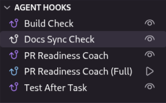
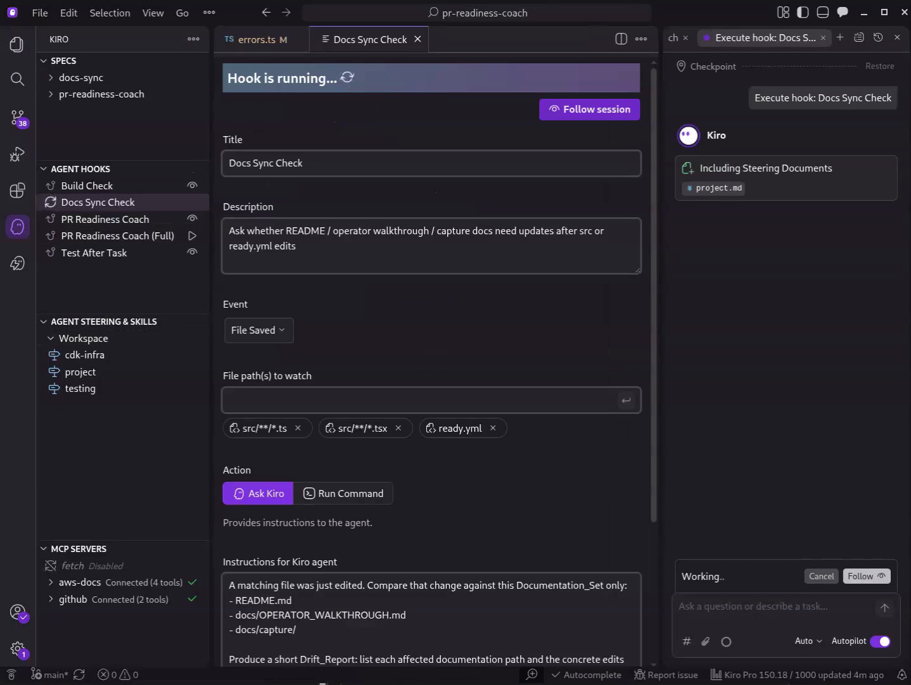
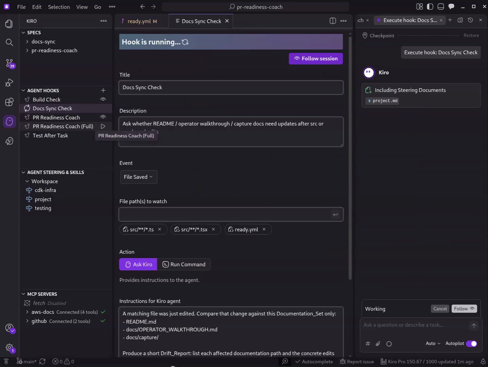
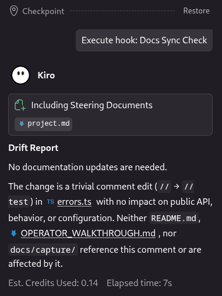

# Day 1: Docs Sync Check — Keeping Docs in Sync with Code

Tag: `#kiro` `#BuildWithKiro`

Kiro Birthday Week Day 1 asked for a hook that automates something meaningful. This post is the Day 1 story for [PR Readiness Coach](https://github.com/jajera/pr-readiness-coach): a **Docs Sync Check** agent hook that watches product source (and `ready.yml`) and reports documentation drift on save.

## Demo video

Silent captions-only walkthrough (~69s): title → expect cards → hooks panel → live `src/` save → live `ready.yml` save → scope → close.

- YouTube: https://youtu.be/2GepvnoJ-i8  
- Local file: [captures/day-01-docs-sync-demo.mp4](captures/day-01-docs-sync-demo.mp4)

<video src="captures/day-01-docs-sync-demo.mp4" controls width="100%"></video>

*(On GitHub, open the `.mp4` or YouTube link if the inline player is unavailable. For AWS Builder Center, upload the local file or embed the YouTube URL.)*

## Problem

Documentation drifts from source code. A developer ships a refactor, updates the logic, tweaks the config — and forgets to touch the README or operator walkthrough. Over time the docs describe a system that no longer exists. Manual review catches some drift, but it depends on memory and discipline.

In a repo with multiple entrypoints (CLI, Lambda, hook, SPA) and a shared core library, even a small change in `src/core/` can invalidate walkthrough steps, architecture descriptions, or capture notes in several places.

## Solution

Docs Sync Check is a Kiro agent hook that fires when a TypeScript file under `src/` or the project `ready.yml` is saved. It uses the `fileEdited` event with an `askAgent` action. The agent compares the change against a fixed Documentation Set (`README.md`, `docs/OPERATOR_WALKTHROUGH.md`, `docs/capture/`) and produces a short Drift Report — or an explicit “no documentation updates needed.”

Detection only: no unsolicited file edits. Patterns stay scoped so `web/` and ordinary docs edits do not burn credits.

### Hooks panel — Docs Sync enabled

Five hooks in this workspace; Docs Sync Check is the Day 1 lead.



### Hook configuration + live run (`src/` save)

On File Saved, watch `src/**/*.ts`, `src/**/*.tsx`, and `ready.yml`. Action is **Ask Kiro** with a bounded prompt (Documentation Set, report-only, ready.yml special case). Saving under `src/` starts the session — “Hook is running…” while the agent includes steering and produces the Drift Report.



### Live run (`ready.yml` save)

The same hook watches `ready.yml`. PR Readiness Coach (the other `fileEdited` hook) does not match `.yml`, so this path isolates Docs Sync.



### Drift Report result

When the session finishes, the agent returns a short Drift Report. For a trivial comment tweak in `errors.ts`, the outcome is an explicit no-updates — with rationale scoped to the Documentation Set.



## How Kiro drove it

Built with Kiro’s spec-driven workflow:

1. **Requirements** — triggers, prompt boundaries, coexistence with existing hooks, Kiro-only voice for challenge copy  
2. **Design** — hook JSON shape, Documentation Set, Birthday materials layout  
3. **Tasks** — implement the hook file, validate schema, smoke via captures, write paste-ready Day 1 pack  

Steering files guided TypeScript conventions and project structure. Specs live under `.kiro/specs/docs-sync/`; the hook file is `.kiro/hooks/docs-sync.kiro.hook`.

## Hook inventory

| Hook | Trigger | Action |
|------|---------|--------|
| **Docs Sync Check** | `fileEdited` on `src/**/*.ts(x)`, `ready.yml` | `askAgent` Drift Report |
| PR Readiness Coach | `fileEdited` on `*.ts` / `*.tsx` / `*.js` / `*.mjs` | `runCommand` heuristic coach |
| PR Readiness Coach (Full) | `userTriggered` | `runCommand` full Bedrock pipeline |
| Build Check | `agentStop` | `runCommand` `npm run build` |
| Test After Task | `postTaskExecution` | `runCommand` `npm test` |

## Try it

- Repository: https://github.com/jajera/pr-readiness-coach  
- Day 1 materials: `docs/birthday-2026/day-01-hooks/`  
- Rebuild the silent demo: `docs/birthday-2026/day-01-hooks/captures/build-demo.py`

```bash
git clone https://github.com/jajera/pr-readiness-coach.git
cd pr-readiness-coach
# Open in Kiro → enable Docs Sync Check → save a file under src/
```

## Assets checklist (for Builder Center upload)

If the publishing UI needs uploads instead of repo-relative paths:

| Asset | Path |
|-------|------|
| Demo video | `captures/day-01-docs-sync-demo.mp4` / https://youtu.be/2GepvnoJ-i8 |
| Hooks panel still | `captures/02-hooks-panel.png` |
| Hook running (`src/`) | `captures/03-hook-running-src-save.png` |
| Hook running (`ready.yml`) | `captures/04-hook-running-ready-yml.png` |
| Drift Report result | `captures/05-drift-report-result.png` |
