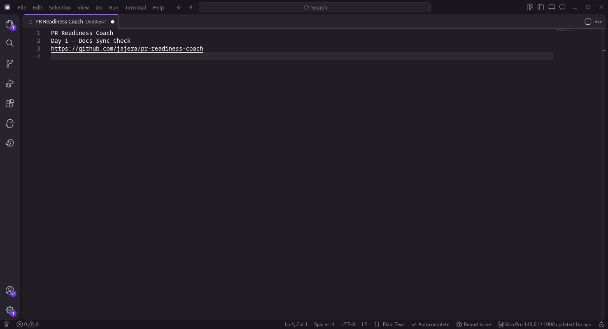
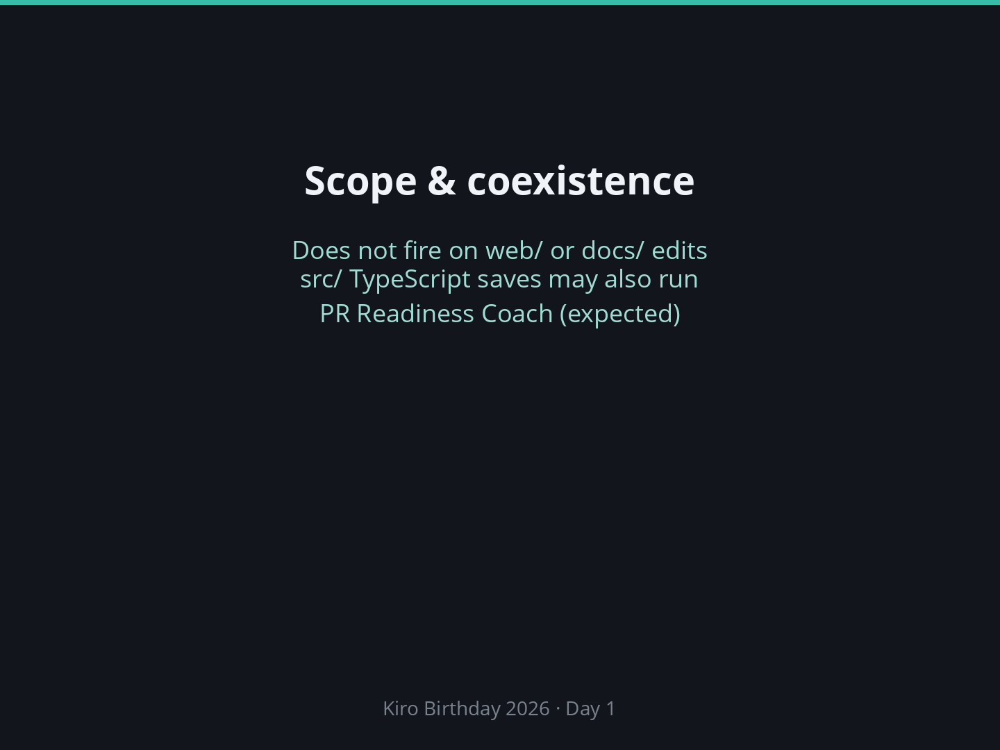
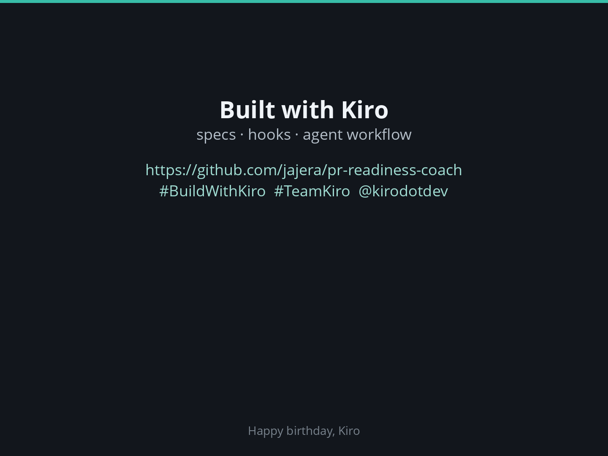

# Day 1 — Docs Sync Check: Smoke Runbook & Silent Demo Script

## Overview

This document serves two purposes:

1. **Smoke runbook** — procedural steps to verify Docs Sync Check works in Kiro
2. **Silent demo script** — caption-only video for the Day 1 submission

**Target**: 30–60 seconds, captions only, no voiceover.

---

## Prerequisites

- Kiro IDE open with the `pr-readiness-coach` workspace loaded
- Docs Sync Check hook enabled (visible in Agent Hooks panel)
- Kiro credits available (`askAgent` fires consume credits)
- All actions are IDE-only — outside-Kiro edits do not trigger hooks

---

## Beat Table

| # | Beat | Caption | On-Screen | Still/Live | Expected Result |
|---|------|---------|-----------|------------|-----------------|
| 1 | Title card | "Day 1 — Docs Sync Check" | Project name + Day 1 theme + repo URL ([captures/01-title-card.png](captures/01-title-card.png)) | Still | — |
| 2 | Hooks panel | "Five hooks configured, Docs Sync Check enabled" | Agent Hooks panel showing all hooks, Docs Sync Check highlighted ([captures/02-hooks-panel.png](captures/02-hooks-panel.png)) | Still | Hook listed and enabled |
| 3 | Positive: src/ save | "Saving a TypeScript file under src/ …" | Editor with trivial edit to `src/core/errors.ts` then save ([captures/03-src-save-docs-sync.mp4](captures/03-src-save-docs-sync.mp4)) | Live | Docs Sync Check fires; Drift Report or no-updates message |
| 4 | Positive: ready.yml save | "Saving ready.yml …" | Editor with trivial edit to `ready.yml` then save ([captures/04-ready-yml-docs-sync.mp4](captures/04-ready-yml-docs-sync.mp4)) | Live | Docs Sync Check fires; PR Readiness Coach does NOT fire |
| 5 | Negative note | "Files outside src/ and ready.yml don't trigger Docs Sync; src/ TS may co-fire PR Readiness Coach" | Caption overlay ([captures/05-negative-note.png](captures/05-negative-note.png)) | Still / caption-only | Negatives documented |
| 6 | Close card | "Built with Kiro — specs, hooks, agent workflow" | Repo URL + hashtags ([captures/06-close-card.png](captures/06-close-card.png)) | Still | — |

---

## Per-Beat Notes

### Beat 1 — Title Card

Static screen. Show the project name (PR Readiness Coach), Day 1 theme (Docs Sync Check), and repository URL. No live action needed.



### Beat 2 — Hooks Panel

Open the Agent Hooks panel in Kiro. All five hooks should be visible:

1. Docs Sync Check (enabled)
2. PR Readiness Coach (enabled)
3. PR Readiness Coach Full (enabled)
4. Build Check (enabled)
5. Test After Task (enabled)

Capture a still screenshot showing Docs Sync Check is present and enabled.


### Beat 3 — Positive: src/ TypeScript Save

1. Open `src/core/errors.ts` in the editor
2. Make a trivial edit (add or remove a blank line, tweak a comment)
3. Save the file

**Expected**: Docs Sync Check fires. The Kiro agent produces either a Drift Report (listing docs that need updates) or a message stating no documentation updates are needed.

**Capture**: [captures/03-src-save-docs-sync.mp4](captures/03-src-save-docs-sync.mp4)

**Note**: PR Readiness Coach may also fire on this save (its glob matches `*.ts`). That is expected coexistence — both hooks can run on the same event.

### Beat 4 — Positive: ready.yml Save

1. Open `ready.yml` in the editor
2. Make a trivial edit (toggle a threshold value, adjust whitespace)
3. Save the file

**Expected**: Docs Sync Check fires (its patterns include `ready.yml`). PR Readiness Coach does NOT fire (its glob is `*.ts, *.tsx, *.js, *.mjs` — does not match `.yml`).

**Capture**: [captures/04-ready-yml-docs-sync.mp4](captures/04-ready-yml-docs-sync.mp4)

### Beat 5 — Negative Note

No live action. This is a caption-only beat documenting negative cases for context:

- Edits to files under `web/` do not trigger Docs Sync Check
- Edits to files under `docs/` do not trigger Docs Sync Check
- Edits to `src/` TypeScript files may co-fire PR Readiness Coach alongside Docs Sync Check



### Beat 6 — Close Card

Static screen. Display:

- Repository URL: https://github.com/jajera/pr-readiness-coach
- `#BuildWithKiro` `#TeamKiro` `@kirodotdev`
- "Built with Kiro — specs, hooks, agent workflow"



---

## Compiled demo (submission-ready)

Silent captioned cut: **[captures/day-01-docs-sync-demo.mp4](captures/day-01-docs-sync-demo.mp4)** (~69s)

**Published:** https://youtu.be/2GepvnoJ-i8

Structure (black title cards before each section):

| Segment | Duration | Content |
|---------|----------|---------|
| Title | 5s | Black card — project, Day 1, repo |
| Expect → Hooks | 5s + 5s | What to expect, then hooks panel still |
| Expect → src/ | 5s + live | What to expect, then `03-src-save-docs-sync.mp4` |
| Expect → ready.yml | 5s + live | What to expect, then `04-ready-yml-docs-sync.mp4` |
| Scope note | 5s | Black card — negatives / coexistence |
| End | 5s | Black card — repo + hashtags |

Upload this file (or a host link) as the Day 1 demo video.

### Rebuild (same look)

```bash
cd docs/birthday-2026/day-01-hooks/captures && python3 build-demo.py
```

Pattern and rules: [captures/README.md](captures/README.md) (5s black title / expect / end; full-IDE scale-to-fit; small UI crops at **native size** on black).


---

## Credits Warning

Each live beat (3 and 4) consumes one `askAgent` credit invocation. Keep edits trivial to minimise agent processing time. Consider disabling Docs Sync Check after the demo to conserve credits during normal development.

---

## Detailed Recording Steps

Use any screen recorder (OBS, SimpleScreenRecorder, GNOME Screenshot + ffmpeg, etc.). Record the full Kiro window or a cropped region that shows editor + Agent Hooks panel side by side.

### Setup (before pressing record)

1. Open Kiro with the `pr-readiness-coach` workspace
2. Open the **Agent Hooks** panel (View → Agent Hooks, or click the hooks icon in the sidebar)
3. Confirm "Docs Sync Check" is listed and shows **enabled**
4. Open `src/core/errors.ts` in a tab (ready for Beat 3)
5. Open `ready.yml` in a second tab (ready for Beat 4)
6. Set screen resolution to 1920×1080 (or 1280×720 for smaller file)
7. Hide notifications / system tray distractions

### Beat-by-Beat Recording Procedure

**Beat 1 — Title Card (5s)**

- Create a simple title image or use a text editor fullscreen with:
  ```
  PR Readiness Coach
  Day 1 — Docs Sync Check
  https://github.com/jajera/pr-readiness-coach
  ```
- Hold for 5 seconds. Add caption overlay in post: "Day 1 — Docs Sync Check"

**Beat 2 — Hooks Panel (5–8s)**

1. Click the Agent Hooks panel to bring it into focus
2. Slowly scroll so all five hooks are visible:
   - Docs Sync Check ✓
   - PR Readiness Coach ✓
   - PR Readiness Coach Full ✓
   - Build Check ✓
   - Test After Task ✓
3. Pause with Docs Sync Check highlighted/visible for 3s
4. Caption: "Five hooks configured, Docs Sync Check enabled"

**Beat 3 — Positive: src/ save (8–12s)**

1. Click the `src/core/errors.ts` tab
2. Place cursor at end of any line
3. Type a comment: `// smoke` (or just add a blank line)
4. Press `Ctrl+S` to save
5. Wait — watch the Agent Hooks panel or chat area
6. **Expected**: Within 5–10s, Docs Sync Check fires. Agent output appears (Drift Report or "no documentation updates needed")
7. If PR Readiness Coach also fires (terminal output `npm run hook`), that's normal — both hooks match `*.ts`
8. Caption: "Saving a TypeScript file under src/ …"
9. Once agent output is visible, hold for 2–3s so viewer can read

**Beat 4 — Positive: ready.yml save (8–12s)**

1. Click the `ready.yml` tab
2. Add a trailing blank line or a YAML comment: `# smoke`
3. Press `Ctrl+S` to save
4. Wait — watch for Docs Sync Check to fire
5. **Expected**: Docs Sync fires (patterns include `ready.yml`). PR Readiness Coach does NOT fire (its glob is `*.ts, *.tsx, *.js, *.mjs`)
6. Caption: "Saving ready.yml …"
7. Hold for 2–3s once output appears
8. **Verify**: only Docs Sync output, no `npm run hook` terminal for PR Readiness Coach

**Beat 5 — Negative Note (4–5s)**

- No live action needed. In post-production, overlay a caption:
  ```
  Files outside src/ and ready.yml don't trigger Docs Sync.
  src/ TS may co-fire PR Readiness Coach — that's expected.
  ```
- Hold for 4–5 seconds. Can show the hooks panel or a static editor view.

**Beat 6 — Close Card (5s)**

- Show a closing screen (text editor fullscreen or image):
  ```
  Built with Kiro — specs, hooks, agent workflow

  https://github.com/jajera/pr-readiness-coach
  #BuildWithKiro #TeamKiro @kirodotdev
  ```
- Hold for 5 seconds

### Post-Recording

1. **Undo smoke edits**: revert `// smoke` from `src/core/errors.ts` and `# smoke` from `ready.yml`, save both
2. **Trim**: cut dead time between beats; target ≤60s total
3. **Add captions**: burn in caption text per beat (use ffmpeg `drawtext` or your editor's subtitle tool)
4. **Export**: MP4, H.264, 30fps, ≤ 50MB (challenge form likely has size limits)
5. **Upload**: post to a public host (YouTube unlisted, Loom, or direct upload to challenge form)
6. **Form**: paste Social Post URL into `form-submission.md` when posted (Demo Video URL already set)

### Timing Budget

| Beat | Target | Cumulative |
|------|--------|------------|
| 1 | 5s | 5s |
| 2 | 6s | 11s |
| 3 | 10s | 21s |
| 4 | 10s | 31s |
| 5 | 5s | 36s |
| 6 | 5s | 41s |

Total: ~41s (within 30–60s target). Trim or pad as needed.

---

## Notes

- Preferred submission file: [captures/day-01-docs-sync-demo.mp4](captures/day-01-docs-sync-demo.mp4) (~52s)
- All captions follow Kiro-only voice — no other IDEs or AI assistants named
- `askAgent` costs credits on beats 3 and 4 — keep edits trivial
- If the hook doesn't fire, check Agent Hooks panel → confirm enabled, then reload Kiro window
- Rebuild helpers in `captures/`: `*-slide.png`, `caption-03.png`, `caption-04.png`, `05-negative-note.png`, `06-close-card.png`
