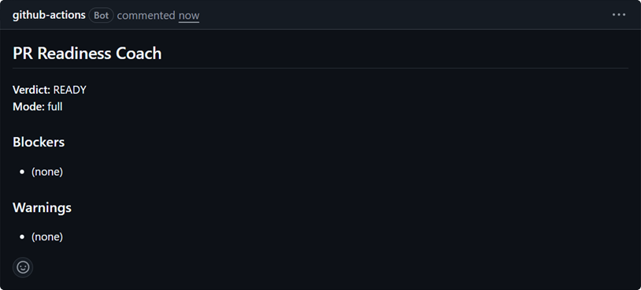
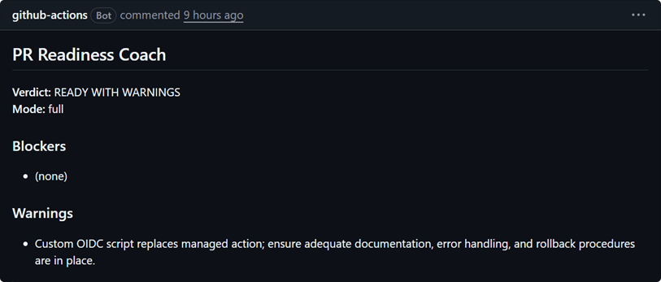

# Capture: PR Demo in CI

## Decision
Warn-only PR comment via `.github/workflows/pr-ready.yml`: build base/head context → POST deployed `/analyze` → upsert comment marked `<!-- pr-readiness-coach -->` → upload artifact → always exit 0. If API secrets are missing or the API returns non-200, fall back to **local heuristics** on the runner (still posts a useful comment).

## What we configured
- Depends on a live API from capture `01` (manual or OIDC `deploy.yml`) for full mode; heuristics fallback otherwise
- Loads root `ready.yml` into the context payload (including `docsPathAllowlist` and `testPathAllowlist`)
- GitHub **Secrets** (Settings → Secrets and variables → Actions), set **after** deploy:
  - `PR_READY_API_URL` — CloudFormation output `ApiUrl` (base URL before `analyze`)
  - `PR_READY_API_KEY` — API key **value** (`aws apigateway get-api-key --include-value`), not `ApiKeyId`
- Steps: walkthrough §2 “GitHub secrets for PR analysis”
- 90s curl timeout; `npm run build` before analyze so `dist/` is available
- Artifact `readiness-report` retained 14 days
- `::warning::` annotation when verdict is NOT READY (job still green)
- Public repo: fork PRs do not get these secrets (heuristics fallback — OK)

## Why
Runners need no Bedrock credentials for the happy path; same Lambda core as CLI `--api`. Local fallback keeps comments useful when secrets or the API are unavailable.

## Pitfalls
- First-time setup must create GitHub secrets after deploy (01 → 02)
- Do not commit key values or echo them in workflows
- Comment upsert depends on HTML marker in body
- Large PR diffs may hit 1 MB API body limit

## Demo evidence
- **Prep (2026-07-12):** `PR_READY_API_URL` and `PR_READY_API_KEY` set in repo Actions secrets from live stack outputs (`ap-southeast-2`). Local CLI `--api` returned `Mode: full`.
- **PR comment upsert:** warn-only job stays green; comment marker `<!-- pr-readiness-coach -->` upserts on open/update.

Clean full-mode comment:

Comment with coach warnings (still warn-only / green job):

## Open questions
None — local heuristics fallback shipped; full mode uses the deployed `/analyze` API key path.
