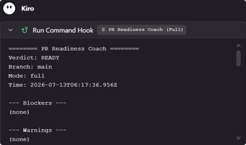
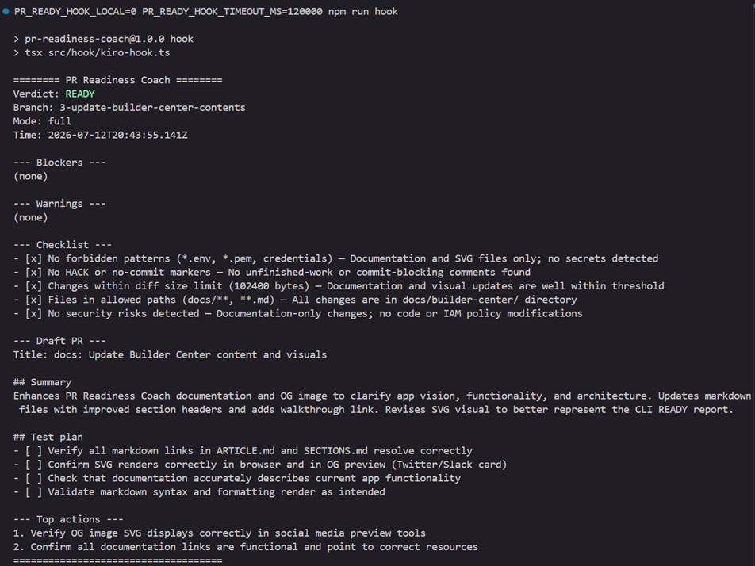

# Capture: Kiro Loop

## Decision
Warn-only analysis via `src/hook/kiro-hook.ts` and IDE hooks under `.kiro/hooks/*.kiro.hook` using the **IDE** schema (`enabled` / `when` / `then` — not the CLI 3.0 `version: v1` + `hooks[]` wrapper, which the Agent Hooks panel does not load):
- `pr-readiness-coach.kiro.hook` — `fileEdited` on `ts|tsx|js|mjs`, heuristic-only, 30s
- `pr-readiness-full.kiro.hook` — `userTriggered`, full Bedrock (`PR_READY_HOOK_LOCAL=0`), 120s
- `build-on-stop.kiro.hook` — `agentStop` → `npm run build`
- `test-after-task.kiro.hook` — `postTaskExecution` → `npm test`

## What we configured
- Default save-hook path is local heuristics (`PR_READY_HOOK_LOCAL` unset or not `0`)
- Manual / CLI full profile uses `PR_READY_HOOK_LOCAL=0` and `PR_READY_HOOK_TIMEOUT_MS=120000`
- Full hook needs `AWS_PROFILE` + `AWS_REGION` visible to the Kiro process (or the terminal); do not commit personal profile names in the hook command
- Prints human report; if not READY, reminds that analysis is warn-only; process always exits `0`
- On timeout/error: “Analysis skipped; push proceeding”
- Runtime alignment: project engines / Lambda use Node.js 24.x; Hook runs via local `tsx`
- Operator steps: walkthrough §3b

## Why
Local feedback on save (and on demand) without blocking merges; reuses the core module shared with CLI and Lambda. Full Bedrock stays on the slower userTriggered/CLI path so save stays under 30s.

## Pitfalls
- Full Bedrock pipeline often exceeds 30s — keep fileEdited on heuristics
- Hook must never hard-fail the editor workflow (exit 0)
- Do not claim Kiro runs inside GitHub Actions
- CLI 3.0 hook JSON (`trigger` / `action` / `hooks[]`) is invisible in the IDE Agent Hooks panel — keep IDE files on `when` / `then`
- Reload the Kiro window if panel entries are stale after file edits

## Demo evidence
2026-07-12: `npm run hook` with a temporary unfinished-work marker in an added walkthrough line → `Mode: heuristic-only`, verdict `READY WITH WARNINGS`, printed warn-only message, exit `0`. Marker removed after the run. Later: `testPathAllowlist` keeps fixture secrets in `tests/**` from failing the hook. Full Bedrock hook run (`PR_READY_HOOK_LOCAL=0`) also returns `READY` with draft PR title/body.

## Open questions
None — IDE `when`/`then` hooks + userTriggered full profile are the supported shape for this repo.
